[TOC]

# 本文简述

本文提出了一种采用 Jinja 模板引擎、SOEM、FreeModbus、Python 实现的一键式代码生成工具，应用场景主要为 EtherCAT 到 Modbus RTU 网关场景下的简化开发，用户数据仅需一个 JSON 数据文件，即可生成 EtherCAT 主站数据条目代码、EtherCAT 从站数据条目代码、Modbus RTU 主站数据条目代码、ESI 文件

## 开箱 & 开发环境

有幸参与 RT-Thread 2025 年的大赛活动，这次选择的是软件赛道、瑞萨 N2L Etherkit 开发板的任务，经过了几天的等待终于收到了开发板，包装很精致

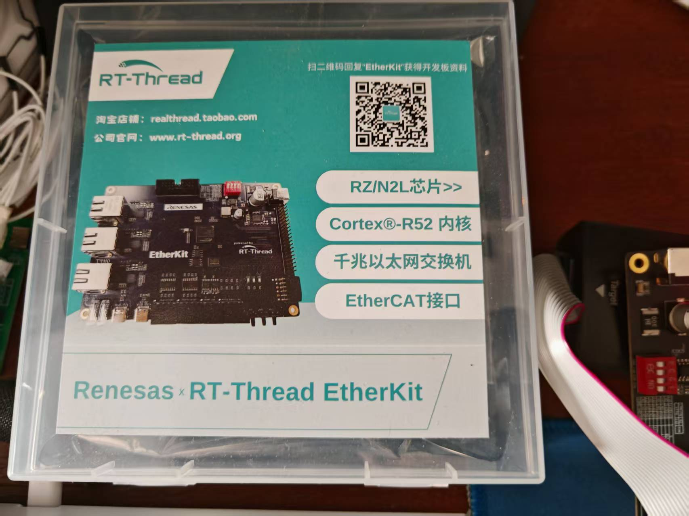

目前是准备做的 EtherCAT 到 Modbus RTU、Modbus TCP 的一个转发协议软件开发，用一个 USB 转 RS485 的小模块搭建了一个简单的 Modbus RTU 通信链路，并且开发板左下角的网口通过一根网线连接到电脑的网口上面

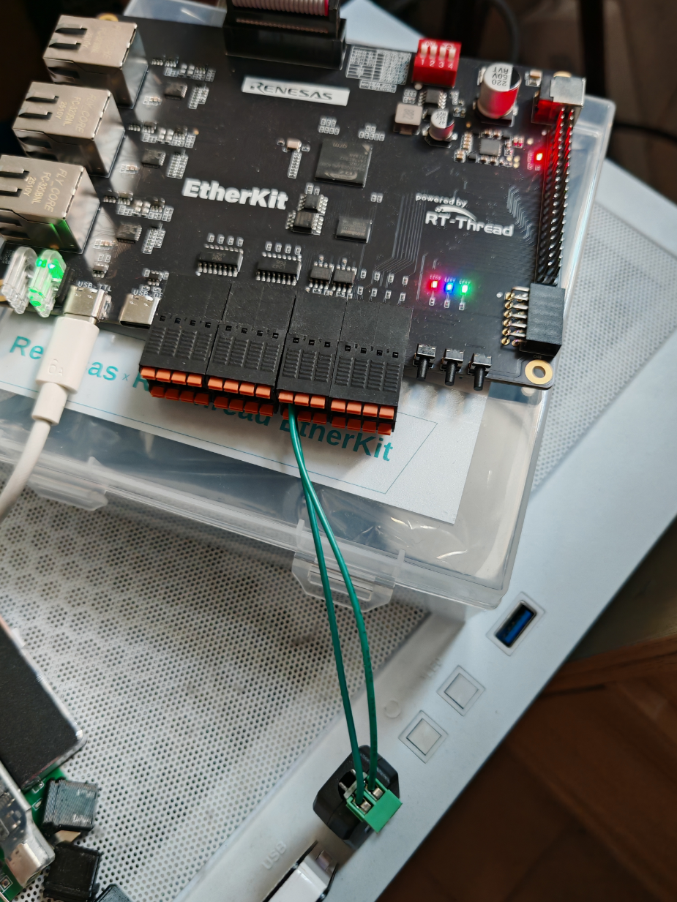

## 开发环境搭建

> 由于需要用到的一些工具、脚本比较繁杂，编译工具链是 ARM GCC，所以果断放弃了在 Windows 下面进行开发，选择在 Ubuntu 24.04 中完成开发

### SDK 拉取

将 Etherkit 的官方 SDK 仓库克隆下来，里面也是有很丰富的例程，包括 EtherCAT、Modbus TCP/RTU、pnet 这些工业网络通信协议 demo 都很完善

```sh
git clone https://github.com/RT-Thread-Studio/sdk-bsp-rzn2l-etherkit.git
```

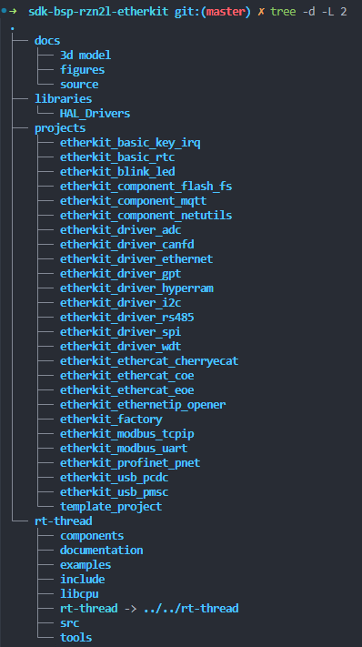

### 配置环境

- 安装 arm-gcc、JLink、RTT env，不再赘述，安装路径：
    - /opt/arm-gnu-toolchain-13.2.Rel1-x86_64-arm-none-eabi
    - /opt/JLink
    - ~/.env


为了使用 vscode+clangd 代码补全功能，这里需要修改 SConstruct 文件，添加对于 compile_commands.json 文件的导出

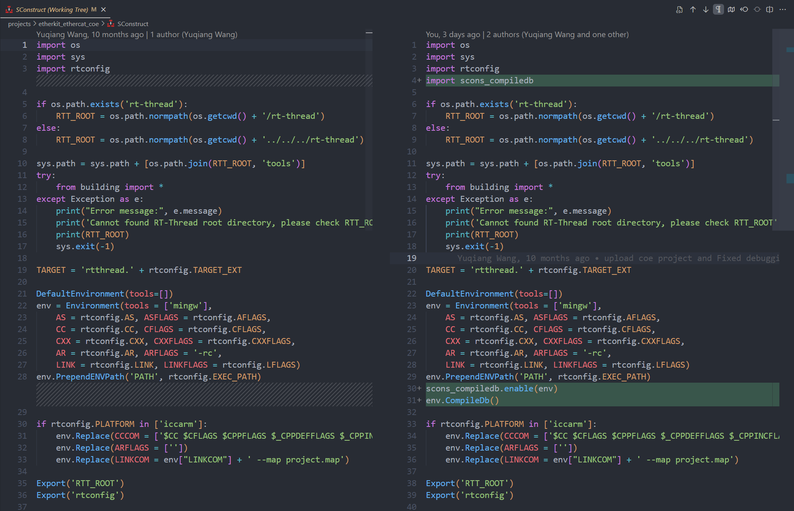

删掉 rtconfig.py 的一行代码

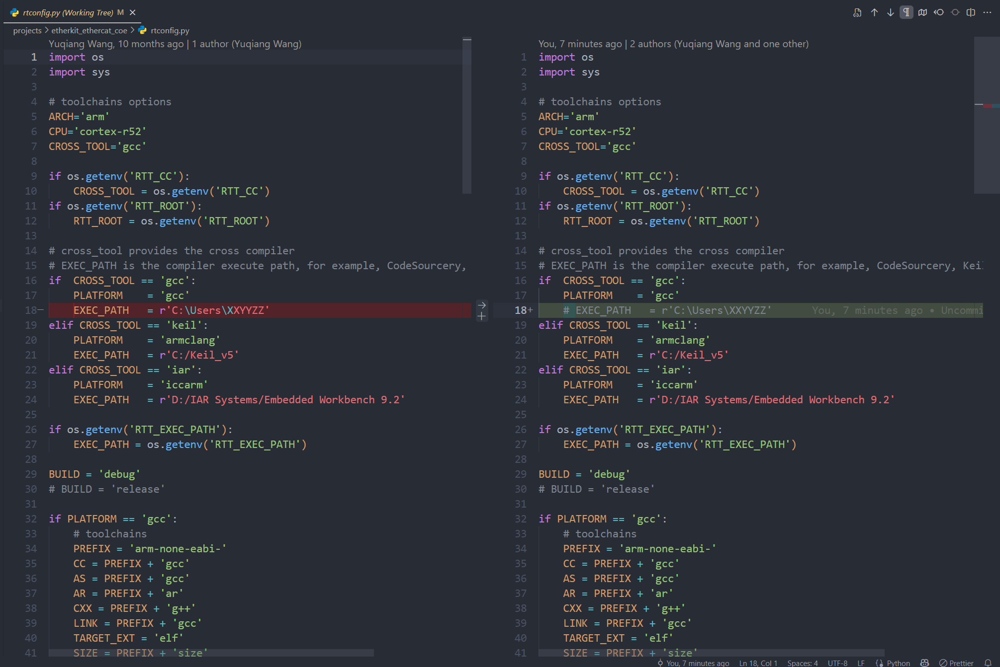

写一个脚本命名为 env_rtt.sh，然后执行 source env_rtt.sh 导入环境变量

```sh
source ~/.env/env.sh

export RTT_CC=gcc

export RTT_EXEC_PATH=/opt/arm-gnu-toolchain-13.2.Rel1-x86_64-arm-none-eabi/bin
export PATH=$PATH:$RTT_EXEC_PATH

alias rttbuild='scons -j16'
alias rttconfig='scons --menuconfig'
alias rttclean='scons --clean'

export rttbuild
export rttconfig
export rttclean

export PATH=$PATH:/opt/JLink
```

编写一个.clangd 文件（路径需要按需修改）

```yml
CompileFlags:
  Add:
    - --sysroot=/opt/arm-gnu-toolchain-13.2.Rel1-x86_64-arm-none-eabi/arm-none-eabi
    - -I/home/pomin/sdk-bsp-rzn2l-etherkit
    - -D_CiA402_
Diagnostics:
  Suppress: "*"
```


编写一个 jlink 下载脚本，命名为 download.jlink

```sh
device R9A07G084M04GBG
if SWD
speed auto
connect
r
erase
loadfile rtthread.hex
verifyfile rtthread.hex
r
go
exit
```

## 测试 CoE demo

搭建完环境之后跳转到 projects/etherkit_ethercat_coe 路径下面准备尝试官方提供的 EtherCAT CoE 这个 Demo 程序，执行如下命令，完成编译、烧录，**其中的路径需要按需修改**

```sh
source env_rtt.sh
scons -j9
sudo /opt/JLink/JLinkExe -device R9A07G084M04 -ExitOnError -CommanderScript /home/pomin/sdk-bsp-rzn2l-etherkit/projects/etherkit_ethercat_coe/download.jlink
```


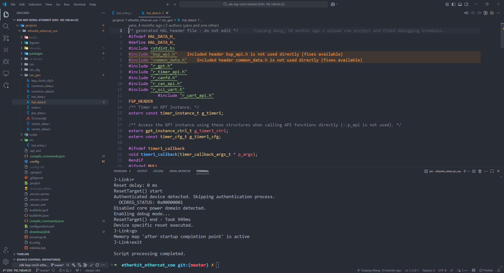

至此 CoE 的 Demo 程序就烧录到了板子当中，打开 shell，启动的 log 如下

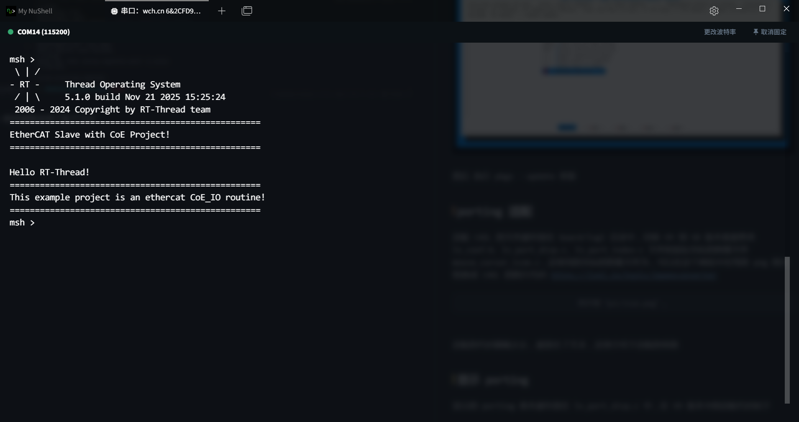

在 projects/etherkit_ethercat_coe/board/ports/ESI_File 路径中有一个 xml 文件，名字为 Renesas EtherCAT RZN2 CoE CDP.xml，这个文件需要复制到 TwinCAT 的指定路径（C:/TwinCAT/3.1/Config/Io/EtherCAT）当中，然后打开 TwinCAT，扫描、添加设备、使用 wireshark 查看网络数据包，可以查看到 EtherCAT 的 Process Data 的抓包

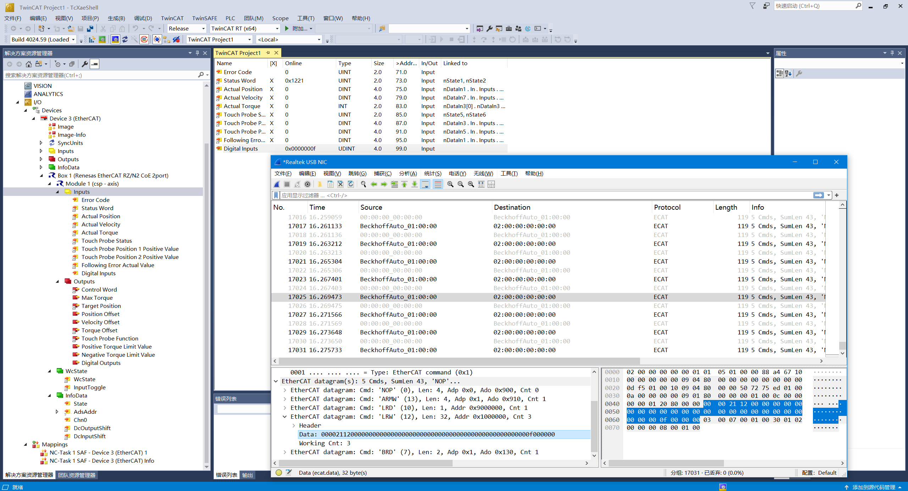

## 测试 Modbus RTU

对于开发板上面的 RS485 接口，查看硬件原理图并用 RZSC 可以看到是用的 SCI5 的 UART 模式

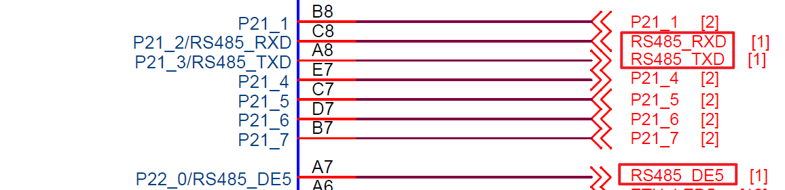

在 RZSC 软件里面设置 SCI5 的几个引脚，和原理图中的引脚相匹配

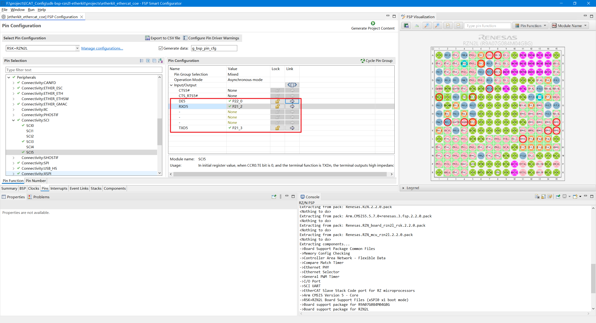

在 Stacks 选项卡里面使能 UART5 和 RS485 DE Pin 的功能

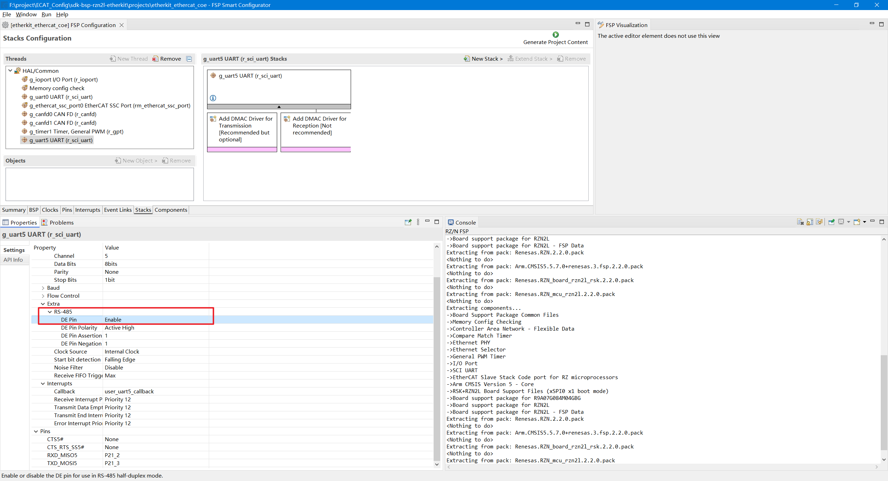

点击 Generate Project Content 按钮生成代码后，将 rzn_gen 文件夹复制到工程中，对于硬件的初始化设置代码的修改就完毕了，然后需要添加 FreeModbus 的代码包，在 menuconfig 界面里面依次打开 > RT-Thread online packages > IoT - internet of things > FreeModbus: Modbus master and slave stack > Master mode，将 RTU master 模式启用，运行 pkgs --update 即可将该代码包添加到工程中

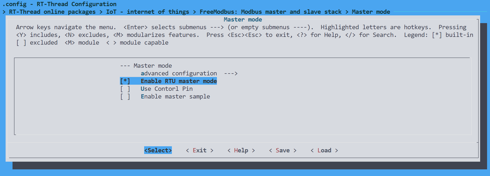

修改 board/Kconfig 文件，添加对于 UART5 的一些宏定义的支持，并在 menuconfig 里面使能、设置

```yaml
                menuconfig BSP_USING_UART5
                    bool "Enable UART5"
                    default n
                    if BSP_USING_UART5
                        config BSP_UART5_RX_USING_DMA
                            bool "Enable UART5 RX DMA"
                            depends on BSP_USING_UART5 && RT_SERIAL_USING_DMA
                            default n

                        config BSP_UART5_TX_USING_DMA
                            bool "Enable UART5 TX DMA"
                            depends on BSP_USING_UART5 && RT_SERIAL_USING_DMA
                            default n

                        config BSP_UART5_RX_BUFSIZE
                            int "Set UART5 RX buffer size"
                            range 64 65535
                            depends on RT_USING_SERIAL_V2
                            default 256

                        config BSP_UART5_TX_BUFSIZE
                            int "Set UART5 TX buffer size"
                            range 0 65535
                            depends on RT_USING_SERIAL_V2
                            default 0
                    endif
```

修改 hal_entry.c 文件内容如下，添加了 Modbus master 的 app 和 initcall 的代码

```c
#include <rtthread.h>
#include "hal_data.h"
#include <rtdevice.h>
#include <board.h>
#include "mb.h"
#include "mb_m.h"

#define DBG_TAG "ECAT2MB"
#define DBG_LVL DBG_LOG
#include <rtdbg.h>

#define LED_PIN_0    BSP_IO_PORT_14_PIN_3 /* Onboard LED pins */
#define LED_PIN_1    BSP_IO_PORT_14_PIN_0 /* Onboard LED pins */
#define LED_PIN_2    BSP_IO_PORT_14_PIN_1 /* Onboard LED pins */

void hal_entry(void)
{
    rt_kprintf("\nHello RT-Thread!\n");
    rt_kprintf("==================================================\n");
    rt_kprintf("This example project is an ethercat CoE_IO routine!\n");
    rt_kprintf("==================================================\n");

    while (1)
    {
        rt_pin_write(LED_PIN_0, PIN_HIGH);
        rt_pin_write(LED_PIN_1, PIN_HIGH);
        rt_pin_write(LED_PIN_2, PIN_HIGH);
        rt_thread_mdelay(1000);
        rt_pin_write(LED_PIN_0, PIN_LOW);
        rt_pin_write(LED_PIN_1, PIN_LOW);
        rt_pin_write(LED_PIN_2, PIN_LOW);
        rt_thread_mdelay(1000);
    }
}

#ifdef PKG_MODBUS_MASTER_SAMPLE
#define SLAVE_ADDR      MB_SAMPLE_TEST_SLAVE_ADDR
#define PORT_NUM        MB_MASTER_USING_PORT_NUM
#define PORT_BAUDRATE   MB_MASTER_USING_PORT_BAUDRATE
#else
#define SLAVE_ADDR      0x01
#define PORT_NUM        5
#define PORT_BAUDRATE   115200
#endif
#define PORT_PARITY     MB_PAR_NONE

#define MB_POLL_THREAD_PRIORITY  10
#define MB_SEND_THREAD_PRIORITY  RT_THREAD_PRIORITY_MAX - 1

#define MB_SEND_REG_START  2
#define MB_SEND_REG_NUM    2

#define MB_POLL_CYCLE_MS   10

static void send_thread_entry(void *parameter)
{
    eMBMasterReqErrCode error_code = MB_MRE_NO_ERR;
    rt_uint16_t error_count = 0;
    USHORT data[MB_SEND_REG_NUM] = {0};

    while (1)
    {
        /* Test Modbus Master */
        data[0] = (USHORT)(rt_tick_get() / 10);
        data[1] = (USHORT)(rt_tick_get() % 10);

        error_code = eMBMasterReqWriteMultipleHoldingRegister(SLAVE_ADDR,          /* salve address */
                                                              MB_SEND_REG_START,   /* register start address */
                                                              MB_SEND_REG_NUM,     /* register total number */
                                                              data,                /* data to be written */
                                                              RT_WAITING_FOREVER); /* timeout */

        /* Record the number of errors */
        if (error_code != MB_MRE_NO_ERR)
        {
            error_count++;
        }
    }
}

static void mb_master_poll(void *parameter)
{
    eMBMasterInit(MB_RTU, PORT_NUM, PORT_BAUDRATE, PORT_PARITY);
    eMBMasterEnable();

    while (1)
    {
        eMBMasterPoll();
        rt_thread_mdelay(MB_POLL_CYCLE_MS);
    }
}

static int mb_master_app(void)
{
    static rt_uint8_t is_init = 0;
    rt_thread_t tid1 = RT_NULL, tid2 = RT_NULL;

    if (is_init > 0)
    {
        rt_kprintf("sample is running\n");
        return -RT_ERROR;
    }
    tid1 = rt_thread_create("md_m_poll", mb_master_poll, RT_NULL, 512, MB_POLL_THREAD_PRIORITY, 10);
    if (tid1 != RT_NULL)
    {
        rt_thread_startup(tid1);
    }
    else
    {
        goto __exit;
    }

    tid2 = rt_thread_create("md_m_send", send_thread_entry, RT_NULL, 512, MB_SEND_THREAD_PRIORITY - 2, 10);
    if (tid2 != RT_NULL)
    {
        rt_thread_startup(tid2);
    }
    else
    {
        goto __exit;
    }

    is_init = 1;
    return RT_EOK;

__exit:
    if (tid1)
        rt_thread_delete(tid1);
    if (tid2)
        rt_thread_delete(tid2);

    return -RT_ERROR;
}

INIT_APP_EXPORT(mb_master_app);

```

编译、烧录到开发板运行，使用 mthings 软件模拟一个 Modbus RTU 的从站，连接到开发板，可以看到开发板作为 Modbus master 设备，在不断的写入 Slave 的地址 2、3 的保持寄存器的数据


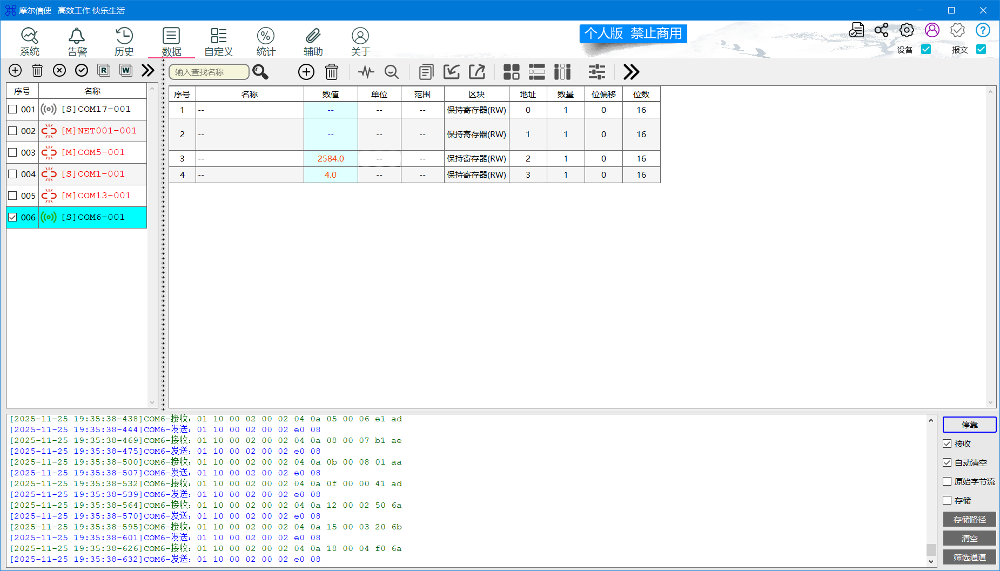

至此，对于 EtherKit 这款开发板的 EtherCAT CoE、Modbus master 的 Demo 搭建和测试已经完毕了，下面步入正题

## 模板化开发

### SSC 工具浅析

> 倍福官方有提供 SSC (Slave Stack Code Tool)，从站代码生成工具，本质上也是模板式开发工具

使用反编译工具查看（此处仅作学习研究用途），可以看到 SSC 工具是用 C# 开发的，可以看到对于设备描述部分的代码，也就是修改 XML 的对应节点

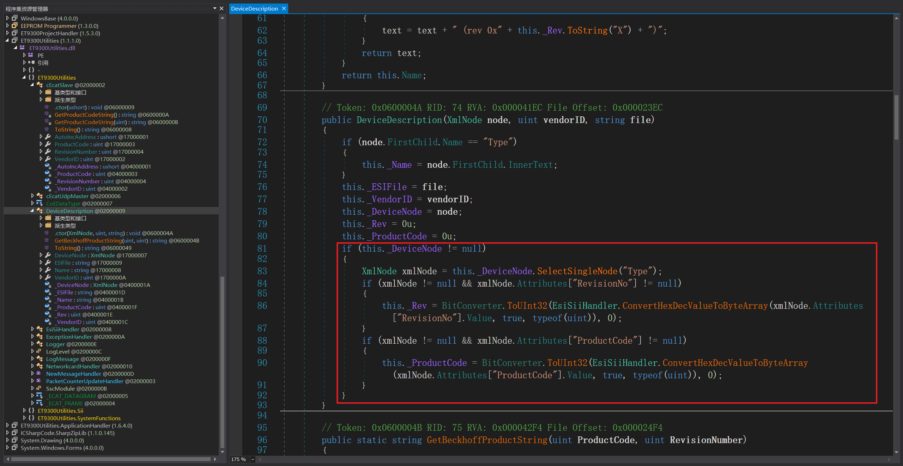

并且 SSC 工具创建的工程文件本质也是经过 zip 压缩的一个 XML 文件，对于 SSC 的工程文件解压缩查看，可以看到其中有很多的代码模板

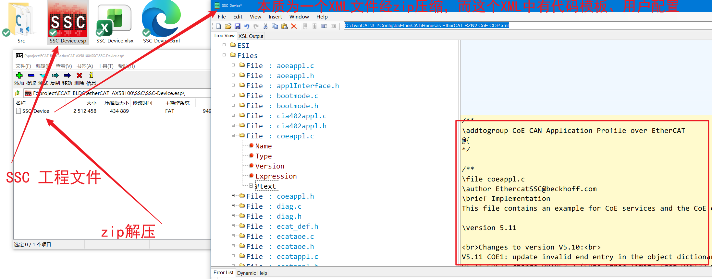

> 类似与 SSC Tool，本文所实现的代码生成辅助工具也是基于模板引擎所搭建，不过重在简化 EtherCAT 到 Modbus RTU 的数据转发场景的开发流程，节省开发的时间成本

### Jinja 方案简述

Jinja 是一个使用 Python 实现的模板引擎，本项目使用 Jinja 来作为 EtherCAT 上位机代码、EtherCAT 从站代码、ESI 文件、用户数据文件（JSON 形式）之间沟通的桥梁方案，总体方案如下：
- Step 1：用户输入指定范式的 JSON 文件，经过 Python 脚本进行解析，解析完成后得到 EtherCAT 侧数据的条目、Modbus 侧数据的条目
- Step 2：基于前一步的数据条目，结合 Jinja 模板引擎，生成从站代码、主站代码，复制到工程中
- Step 3：主从站工程编译、更新，完成 PC 经 EtherCAT 和 开发板通讯，同时开发板经 Modbus RTU 和 Modbus 从站通讯，完成通讯链路

基于此方法，无需反复维护 EtherCAT 主站代码、EtherCAT 从站代码、数据结构表格，节省开发时的时间成本，仅需使用 JSON 来完成数据条目的制定即可（基于 JSON 格式，或可添加经 MQTT 到云端数据交互的代码生成等拓展）

### Modbus RTU & CoE SDO 简介

Modbus RTU 是工业现场最经典、最普遍的串行通信协议，免费、简单、数据传输周期通常只有十毫秒到百毫秒级别。

CoE，全称为 CANopen on EtherCAT，是 EtherCAT 上最主流的应用层协议，把完整的 CANopen 机制（对象字典、SDO、PDO 等）直接映射到 EtherCAT 上
- **对象字典**：和 CANopen 100% 一样（0x1000~0x9FFF）
- **SDO**：配置参数，用邮箱（Mailbox）读写对象字典
- **PDO**：实时数据，直接映射到 EtherCAT 过程数据，微秒级
- **标准行规**：CiA401、CiA402、CiA406 等全部直接可用
- **配置文件**：EDS 或 EtherCAT XML

基于本工程的需求（EtherCAT 到 Modbus RTU 的协议转换），EtherCAT 端选择采用 CoE 的应用层协议完成到 Modbus RTU 侧的数据对接，目标完成至少 10ms 周期的轮询数据同步

### EtherCAT 从站 → Modbus RTU 主站映射

对于 EtherCAT 从站 → Modbus RTU 主站映射功能的开发，在 EtherCAT 侧主要是实现用户数据对象到 EtherCAT 协议栈内的数据结构的转换、用户数据对象到 Modbus RTU 协议栈的读写数据请求的转换，例如如下的用户数据对象

```c
// ===== EtherCAT → Modbus RTU 映射表（自动生成）=====
// 生成时间: 2025-11-29 00:12:38
// 共 10 个对象

e2m_mdata_t mdata_list[] = {
    { 0x3000, 0x01, 0x0000, "状态字" },  // 设备1运行状态
    { 0x3001, 0x01, 0x0001, "转速设定" },  // 目标转速
    { 0x3002, 0x01, 0x0002, "实际转速" },  // 当前转速
    { 0x3003, 0x01, 0x0003, "运行电流" },  // 电流反馈
    { 0x3004, 0x02, 0x0010, "阀门开度" },  // 调节阀开度
    { 0x3005, 0x02, 0x0001, "管道压力" },  // 压力值
    { 0x3006, 0x03, 0x0002, "环境温度" },  // 温度传感器
    { 0x3007, 0x01, 0x0005, "故障代码" },  // 报警信息
    { 0x3008, 0x01, 0x0004, "运行时间高" },  // 累计运行时间高16位
    { 0x3009, 0x01, 0x0009, "运行时间低" }  // 累计运行时间低16位
};

UINT16 mdata_count = 10;

// ==============================================
```

这里绘制了一个简单的流程图，创建两个线程用来单独处理轮询和数据读写请求

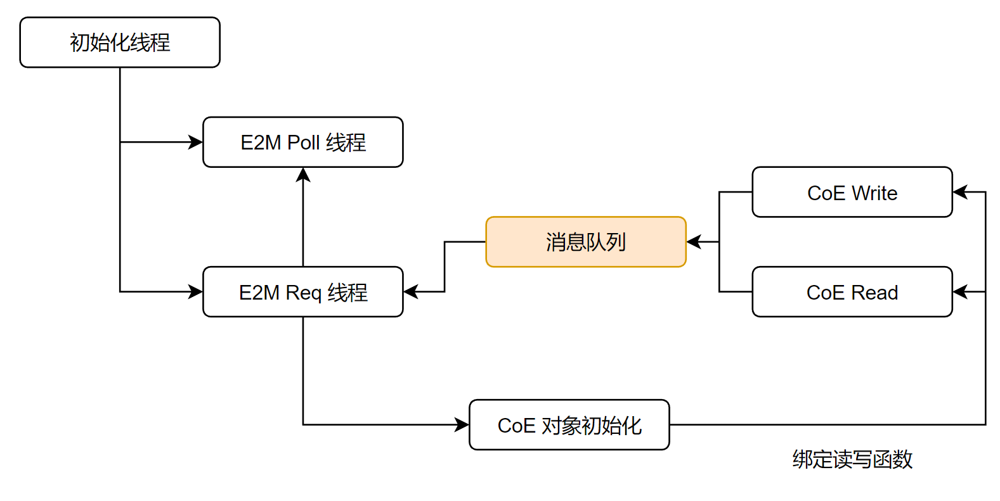

开发板端运行的完整代码工程仓库如下：

[GitHub - POMIN-163/sdk-bsp-rzn2l-etherkit-e2m-test](https://github.com/POMIN-163/sdk-bsp-rzn2l-etherkit-e2m-test)


### EtherCAT 主站

这里选用 SOEM 作为 EtherCAT Master 的代码库，imgui 作为界面库，具体构建流程不详细展开了，最终显示效果如下

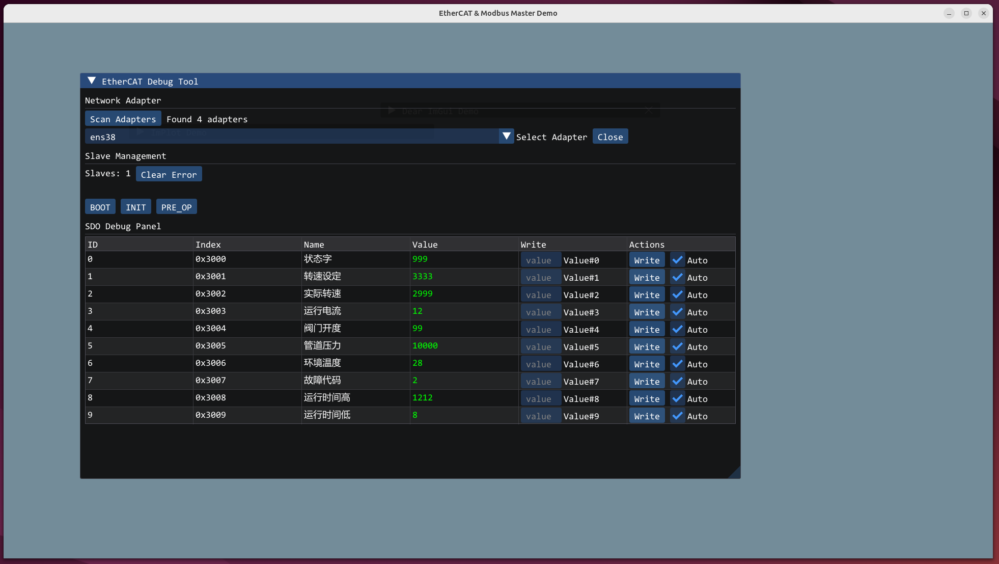

而主站侧的数据条目的代码就十分简单，因为只需要进行 EtherCAT CoE 的读写，所以只需要给出 SDO 的 index 即可

```c
// ===== 主站 SDO 对象配置（自动生成）=====
// 生成时间: 2025-11-29 00:12:38
// 共 10 个对象

static SDO_Object sdo_objects[] = {
    { 0x3000, u8"状态字", 0, "", true }, // 设备1运行状态  设备 1 寄存器 0
    { 0x3001, u8"转速设定", 0, "", true }, // 目标转速  设备 1 寄存器 1
    { 0x3002, u8"实际转速", 0, "", true }, // 当前转速  设备 1 寄存器 2
    { 0x3003, u8"运行电流", 0, "", true }, // 电流反馈  设备 1 寄存器 3
    { 0x3004, u8"阀门开度", 0, "", true }, // 调节阀开度  设备 2 寄存器 16
    { 0x3005, u8"管道压力", 0, "", true }, // 压力值  设备 2 寄存器 1
    { 0x3006, u8"环境温度", 0, "", true }, // 温度传感器  设备 3 寄存器 2
    { 0x3007, u8"故障代码", 0, "", true }, // 报警信息  设备 1 寄存器 5
    { 0x3008, u8"运行时间高", 0, "", true }, // 累计运行时间高16位  设备 1 寄存器 4
    { 0x3009, u8"运行时间低", 0, "", true } // 累计运行时间低16位  设备 1 寄存器 9
};

static const int sdo_count = 10;

// ==============================================
```

上位机端运行的完整代码工程仓库如下：

[GitHub - POMIN-163/master-e2m-test](https://github.com/POMIN-163/master-e2m-test)

### ESI 文件

对于 TwinCAT 等商用级的 EtherCAT 主站软件，经常会用到 ESI 文件作为 EtherCAT 从站的描述文件使用，而手动修改 xml 也较为繁琐，针对前文的数据条目，在 ESI 文件中添加 OD 如下

```xml
    <Object>
        <Index>#x3000</Index>
        <Name>状态字</Name>
        <Type>UINT</Type>
        <BitSize>16</BitSize>
        <Info>
            <Description>设备1运行状态</Description>
        </Info>
        <Flags>
            <Access>rw</Access>
        </Flags>
    </Object>
    <Object>
        <Index>#x3001</Index>
        <Name>转速设定</Name>
        <Type>UINT</Type>
        <BitSize>16</BitSize>
        <Info>
            <Description>目标转速</Description>
        </Info>
        <Flags>
            <Access>rw</Access>
        </Flags>
    </Object>
    <Object>
        <Index>#x3002</Index>
        <Name>实际转速</Name>
        <Type>UINT</Type>
        <BitSize>16</BitSize>
        <Info>
            <Description>当前转速</Description>
        </Info>
        <Flags>
            <Access>rw</Access>
        </Flags>
    </Object>
    <Object>
        <Index>#x3003</Index>
        <Name>运行电流</Name>
        <Type>UINT</Type>
        <BitSize>16</BitSize>
        <Info>
            <Description>电流反馈</Description>
        </Info>
        <Flags>
            <Access>rw</Access>
        </Flags>
    </Object>
    <Object>
        <Index>#x3004</Index>
        <Name>阀门开度</Name>
        <Type>UINT</Type>
        <BitSize>16</BitSize>
        <Info>
            <Description>调节阀开度</Description>
        </Info>
        <Flags>
            <Access>rw</Access>
        </Flags>
    </Object>
    <Object>
        <Index>#x3005</Index>
        <Name>管道压力</Name>
        <Type>UINT</Type>
        <BitSize>16</BitSize>
        <Info>
            <Description>压力值</Description>
        </Info>
        <Flags>
            <Access>rw</Access>
        </Flags>
    </Object>
    <Object>
        <Index>#x3006</Index>
        <Name>环境温度</Name>
        <Type>UINT</Type>
        <BitSize>16</BitSize>
        <Info>
            <Description>温度传感器</Description>
        </Info>
        <Flags>
            <Access>rw</Access>
        </Flags>
    </Object>
    <Object>
        <Index>#x3007</Index>
        <Name>故障代码</Name>
        <Type>UINT</Type>
        <BitSize>16</BitSize>
        <Info>
            <Description>报警信息</Description>
        </Info>
        <Flags>
            <Access>rw</Access>
        </Flags>
    </Object>
    <Object>
        <Index>#x3008</Index>
        <Name>运行时间高</Name>
        <Type>UINT</Type>
        <BitSize>16</BitSize>
        <Info>
            <Description>累计运行时间高16位</Description>
        </Info>
        <Flags>
            <Access>rw</Access>
        </Flags>
    </Object>
    <Object>
        <Index>#x3009</Index>
        <Name>运行时间低</Name>
        <Type>UINT</Type>
        <BitSize>16</BitSize>
        <Info>
            <Description>累计运行时间低16位</Description>
        </Info>
        <Flags>
            <Access>rw</Access>
        </Flags>
    </Object>
```


### 模板化整合

针对前文介绍的
- EtherCAT 从站 → Modbus RTU 主站映射
- EtherCAT 主站
- ESI 文件

可以发现，在增删数据式对应的几个文件需要分别修改，十分繁琐，设计使用一个 JSON 文件去完成对此前三个文件的生成，JSON 数据条目文件如下

```json
{
  "od": [
    {
      "index": "0x3000",
      "name": "状态字",
      "modbus_dev": 1,
      "modbus_reg": 0,
      "comment": "设备1运行状态"
    },
    {
      "index": "0x3001",
      "name": "转速设定",
      "modbus_dev": 1,
      "modbus_reg": 1,
      "comment": "目标转速"
    },
    {
      "index": "0x3002",
      "name": "实际转速",
      "modbus_dev": 1,
      "modbus_reg": 2,
      "comment": "当前转速"
    },
    {
      "index": "0x3003",
      "name": "运行电流",
      "modbus_dev": 1,
      "modbus_reg": 3,
      "comment": "电流反馈"
    },
    {
      "index": "0x3004",
      "name": "阀门开度",
      "modbus_dev": 2,
      "modbus_reg": 16,
      "comment": "调节阀开度"
    },
    {
      "index": "0x3005",
      "name": "管道压力",
      "modbus_dev": 2,
      "modbus_reg": 1,
      "comment": "压力值"
    },
    {
      "index": "0x3006",
      "name": "环境温度",
      "modbus_dev": 3,
      "modbus_reg": 2,
      "comment": "温度传感器"
    },
    {
      "index": "0x3007",
      "name": "故障代码",
      "modbus_dev": 1,
      "modbus_reg": 5,
      "comment": "报警信息"
    },
    {
      "index": "0x3008",
      "name": "运行时间高",
      "modbus_dev": 1,
      "modbus_reg": 4,
      "comment": "累计运行时间高16位"
    },
    {
      "index": "0x3009",
      "name": "运行时间低",
      "modbus_dev": 1,
      "modbus_reg": 9,
      "comment": "累计运行时间低16位"
    }
  ]
}
```

然后结合 Jinja 工具，编写如下三套模板

- 从站端

```c
// ===== EtherCAT → Modbus RTU 映射表（自动生成）=====
// 生成时间: {{ now.strftime("%Y-%m-%d %H:%M:%S") }}
// 共 {{ od|length }} 个对象

e2m_mdata_t mdata_list[] = {

    { {{ item.index }}, 0x{{ "%02X"|format(item.modbus_dev) }}, 0x{{ "%04X"|format(item.modbus_reg) }}, "{{ item.name }}" }{{ "," if not loop.last else "" }}  // {{ item.comment }}


};

UINT16 mdata_count = {{ od|length }};

// ==============================================

```


- 主站端

```c
// ===== 主站 SDO 对象配置（自动生成）=====
// 生成时间: {{ now.strftime("%Y-%m-%d %H:%M:%S") }}
// 共 {{ od|length }} 个对象

static SDO_Object sdo_objects[] = {

    { {{ item.index }}, u8"{{ item.name }}", 0, "", true }{{ "," if not loop.last else "" }} // {{ item.comment }}  设备 {{ item.modbus_dev}} 寄存器 {{item.modbus_reg }}

};

static const int sdo_count = {{ od|length }};

// ==============================================

```

- ESI 端

```xml

    <Object>
        <Index>#x{{ "%04X"|format(item.index|int(0,16)) }}</Index>
        <Name>{{ item.name }}</Name>
        <Type>{{ "UINT" if item.type|default("uint16") == "uint16" else "UDINT" }}</Type>
        <BitSize>{{ 16 if item.type|default("uint16") == "uint16" else 32 }}</BitSize>
        <Info>
            <Description>{{ item.comment|default("") }}</Description>
        </Info>
        <Flags>
            <Access>{{ item.access|default("rw") }}</Access>
        </Flags>
    </Object>

```


然后编写对于此前三个模板进行调用的 python 脚本

```python
import json, re
from jinja2 import Environment, FileSystemLoader
from datetime import datetime

with open("data.json", "r", encoding="utf-8") as f:
    config = json.load(f)

env = Environment(loader=FileSystemLoader("templates"), trim_blocks=True, lstrip_blocks=True)
env.globals['now'] = datetime.now()

# 1. 生成文件
templates = [
    ("ecat_slave.h.j2", "output/ecat_slave_data.h"),
    ("ecat_master.h.j2", "output/ecat_master_data.h"),
]

for tmpl_name, output_path in templates:
    template = env.get_template(tmpl_name)
    output = template.render(od=config["od"])
    with open(output_path, "w", encoding="utf-8", newline='\n') as f:
        f.write(output)
    print(f"Generated: {output_path}")

# 2. 生成并插入 ESI
esi_template = env.get_template("esi.xml.j2")
generated_xml = esi_template.render(od=config["od"])

with open("input.xml", "r", encoding="utf-8") as f:
    content = f.read()

start = "<!-- ==== CUSTOM MODBUS MAPPING OBJECTS START ==== -->"
end   = "<!-- ==== CUSTOM MODBUS MAPPING OBJECTS END ==== -->"
pattern = f"({re.escape(start)}).*?({re.escape(end)})"
replacement = f"{start}\n    {generated_xml.strip()}\n    {end}"

new_content = re.sub(pattern, replacement, content, flags=re.DOTALL)

with open("output/esi.xml", "w", encoding="utf-8", newline='\n') as f:
    f.write(new_content)

print(f"ESI 更新完成！共 {len(config['od'])} 个对象已插入")
```

采用这个脚本即可完成对于前文的三个代码文件的生成，只需包含到各自的工程即可使用

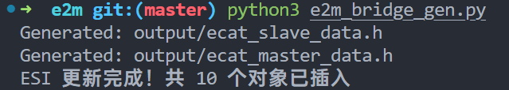

**此后如需增添数据条目、增删 Modbus RTU 设备，只需修改 JSON 文件，运行生成脚本即可**

## 综合测试

综合前文介绍，对于完整工程进行测试，使用 Mthings 模拟 Modbus RTU 从站，可以看到完整的通讯链路稳定运行

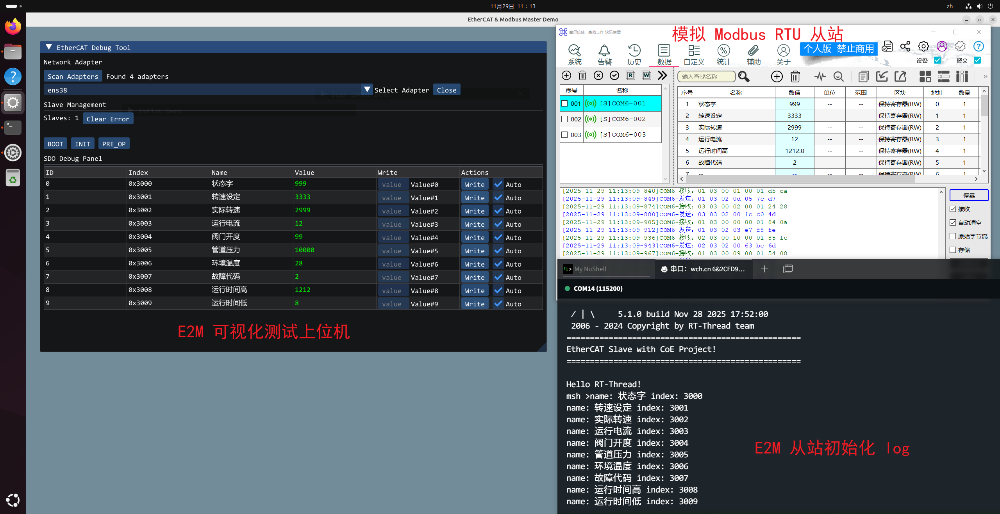

将生成的 ESI 文件放置到 TwinCAT 指定目录后，使用 TwinCAT 查看结果如下，也可以正常的识别、读取到 Modbus 端的数据

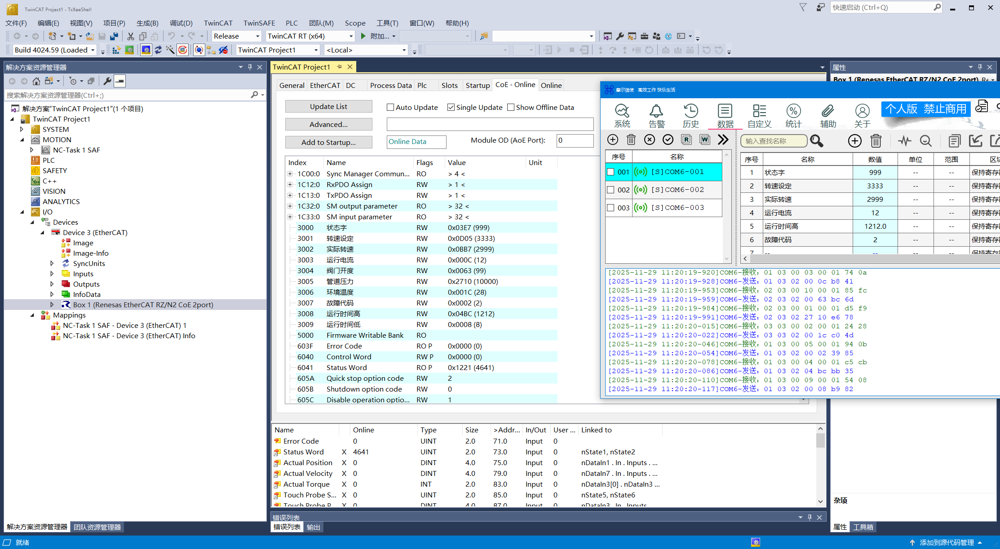


所有程序与结果均符合预期，本文介绍到此为止，涉及到的代码仓库如下：

从站： [GitHub - POMIN-163/sdk-bsp-rzn2l-etherkit-e2m-test](https://github.com/POMIN-163/sdk-bsp-rzn2l-etherkit-e2m-test)

主站：[GitHub - POMIN-163/master-e2m-test](https://github.com/POMIN-163/master-e2m-test)


